# Assigment 17.1

#### Link to Jupyter notebook file: [Assignment 17.1 Terrence](assignment_17_1_Terrence.ipynb)

## CRISP-DM Framework

### Business Understanding

Banks would like to predict which customers are more likely to subscribe to a term deposit. Based on the dataset given, some data questsions that can be asked are what features more greatly affect the likelyhood of a customer to purchase? Can the prediction of likelyhood to buy be predicted on given attributes with resonable accuracy? Which customers to target for a marketing campaign to yield highest sucess rate?

### Data Understanding

Steps to start to get to know the dataset: Checking the number of features and rows. Checking for missing data and determine how it can affect the dataset. Checking info, describe and head to get a snapshot of the dataset.

### Data Preparation

Snapshot of the dataset:

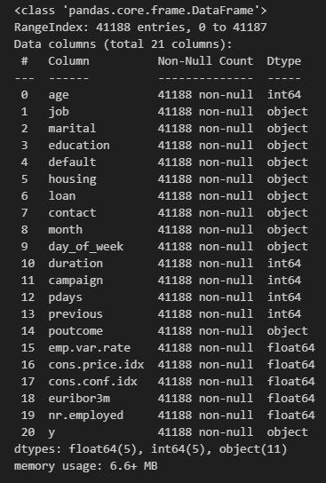

The dataset had no NA entries but did have entries that were 'uknown'. For the purpose of the questions that is trying to be answerd, converting the 'uknown' to NA and dropping all NA values should not affect the dataset.

Unknown Counts:

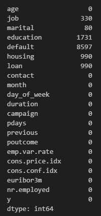

Used One Hot Encoder for the following features: ['marital', 'housing', 'loan', 'contact', 'poutcome']
Used Oridnal Encoding for the following features: ['job', 'education', 'month', 'day_of_week']
Changed y category from 'yes' and 'no' to 0 and 1

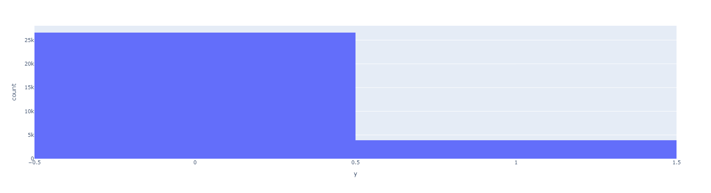

There are more entries with a no outcome than a yes outcome

#### Heatmap

Upon looking at correlation, some other notable features to look into are:
- euribor3m has high positive correlation with emp.var.rate
- nr.employed has high positive correlation with emp.var.rate
- poutcome_success has high negative correlation with pdays

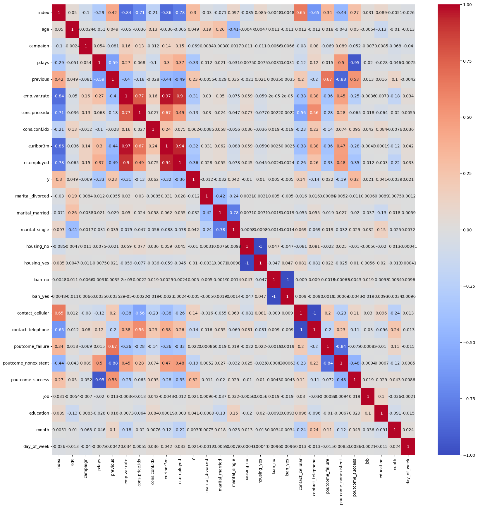

### Modeling

Used four different classification models: 
- Logistic regression
- K nearest neighbor (KNN)
- Decision tree classifier
- Support vector machine (SVM).

Used a 20 percent train/test split

With each model, test accuracy was calculated and training time was recored. A reciever operator curve (ROC) was also calulated. Test accuracy shows an understanding of the model effectiveness and the ROC can be used to futher compare between models, which one would be more effective.

After base model tests were conducted, hypertuning of parameters were done on all four models using GridSearchCV to look for best parameters for each model.

### Evaluation

Findings analysis:

Logistic Regression accuracy: 88.37%

Logistic Regression ROC:
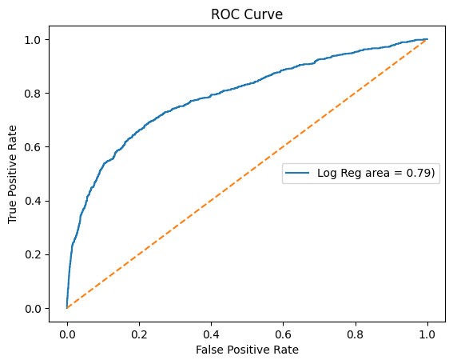

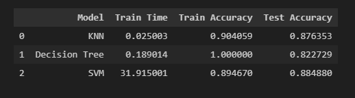

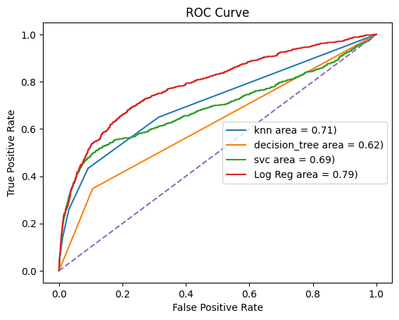

#### With hypertuning parameters

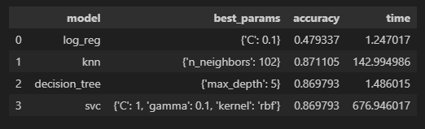

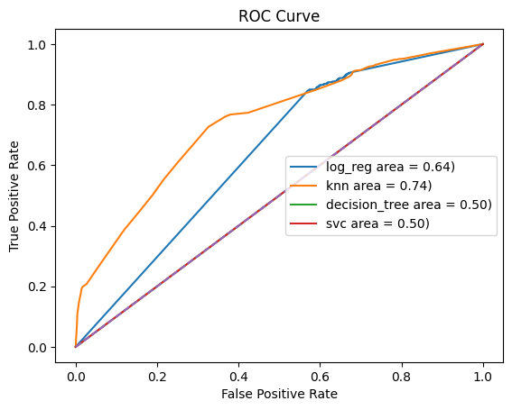

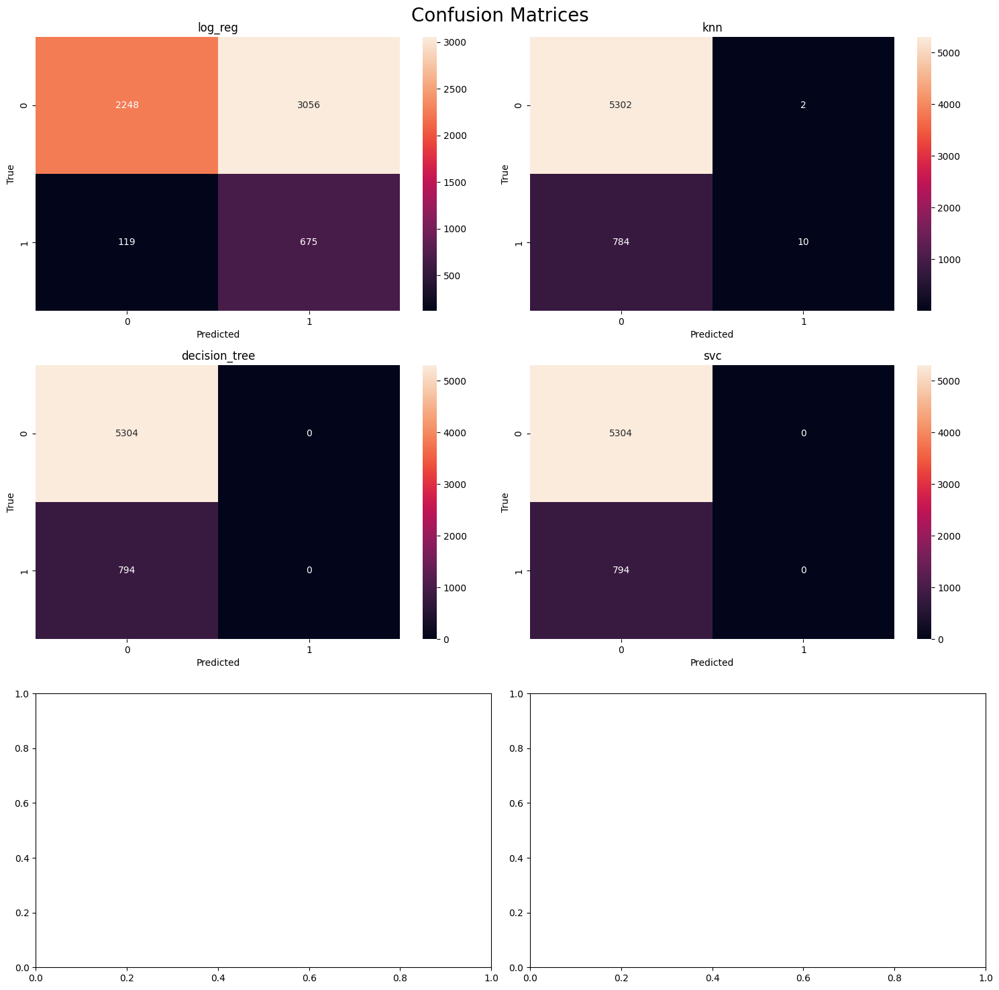

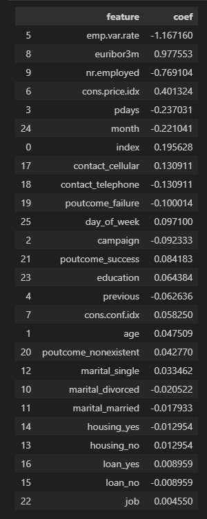

Conclusions:
Logistic Regression: accuracy 88.37
KNN: accuracy 87.64
Decision Tree: accuracy 82.27
SVM: accuracy 88.49

With hyper parameter tuning:
Logistic Regression: 47.93
KNN: 87.11
Decision Tree: 86.98
SVM: 86.98

Variables that have the highest coefficients
emp.var.rate
euribor3m
nr.employed
cons.price.idx

### Deployment

Based on evaluation above, SVM may be the best model in terms of accuracy in terms of the base model at 88.49 percent. With parameter tuning, KNN has the highest accuracy at 87.11 percent with the best parameter being 'n_neighbors = 102'. 

Interesting to note that Logistic Regression had the highest ROC area at 0.79.

The ROC curve analysis for the four models using hypertuning came out with KNN having the highest area.

Notable features that might have a high impact on wheter or not a customer will purchase a deposit term:
emp.var.rate (employment variation rate)
euribor3m (euribor 3 month rate)
nr.employed (number of employees)
cons.price.idx (consumer price index)

emp.var.rate, euribor3m, and cons.price.idx might indicate current economic factors that contribute to whether  a customer will buy.

nr.employed may be related to the time of the year predictions.

In the future, looking into wealth of the customer and whether or not they have current products with the bank can be benefical to generate a higher success rate in marketing campaigns to get customers to buy services.

*Refer to Jupyter notebook for more calculations and figures.